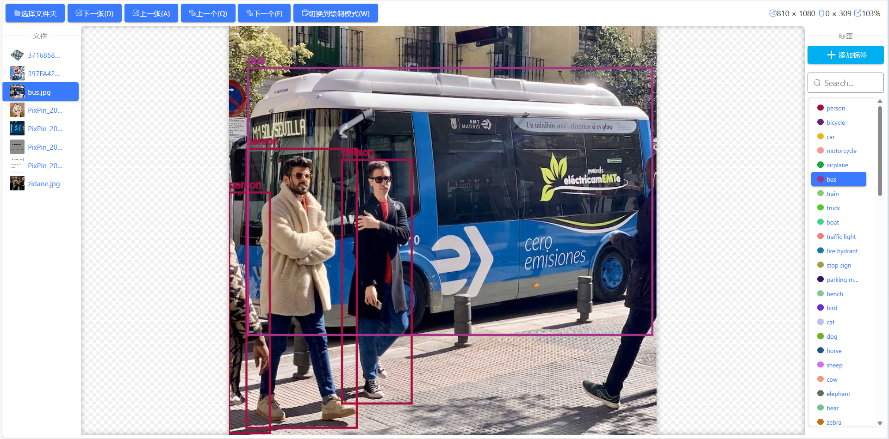

# 推荐使用labelStudio进行更专业的数据标注
[labelStudio(github)](https://github.com/HumanSignal/label-studio)
# 简介
一个适用于 yolov8（只使用过v8，其他不了解） 数据集的**网页**端标注工具。  
打开即用、无需上传图片就是它的优点！  
基于vue3+ts，不依赖后端和任何服务器(在线图标使用了iconify除外)。  
  
# 使用方法
键盘：  
`A` => `切换上一张图片`  
`D` => `切换下一张图片`  
`Q` => `切换上一个标签`  
`E` => `切换下一个标签`  
`W` => `切换模式*`  
`ctrl + z` => `撤回（删除最后一个框）`  
  
 鼠标：  
`鼠标滚轮` => `缩放画布`  
`鼠标左键` => `进行标注`  
`鼠标右键（绘制模式）` => `拖动平移画布`  
`鼠标右键（编辑模式）` => `删除标记（当前鼠标指向的标记）`  
ps 保存是在你切换图片的时候自动保存到你选择的输出目录，无需手动保存   
### 模式
`绘制模式（默认）`:可以移动画布。不可以移动标记，改变标记大小，删除标记。  
`编辑模式`:可以移动标记、改变标记大小、删除标记。不可以移动画布（因为右键删除和右键移动画布冲突）。  
# ⚠浏览器兼容性
 由于使用了 showDirectoryPicker 的 Api，兼容性比较差  
[浏览器兼容性详情](https://developer.mozilla.org/zh-CN/docs/Web/API/Window/showDirectoryPicker#%E6%B5%8F%E8%A7%88%E5%99%A8%E5%85%BC%E5%AE%B9%E6%80%A7)
# 在线体验地址
[在线体验](https://ferretangel.github.io/labelImage/)
# 后续计划
1.优化ui设计  
2.处理其他浏览器兼容性  
3.数据格式自定义转换（可以通过在线编写js代码，实现对其他格式数据的实时读写）  
4.增加更多自定义选项（框的粗细等等，或者自动根据图片分辨率来动态调整框的粗细和标签名字大小）  
  
ps.以上顺序不分先后。  
## 项目使用  
```sh
https://github.com/FerretAngel/labelImageWeb.git
```
```sh
npm i
```
```sh
npm run dev
```
### 项目编译
```sh
npm run build
```
# 问题
如有问题可以联系:ferret.icu@qq.com
